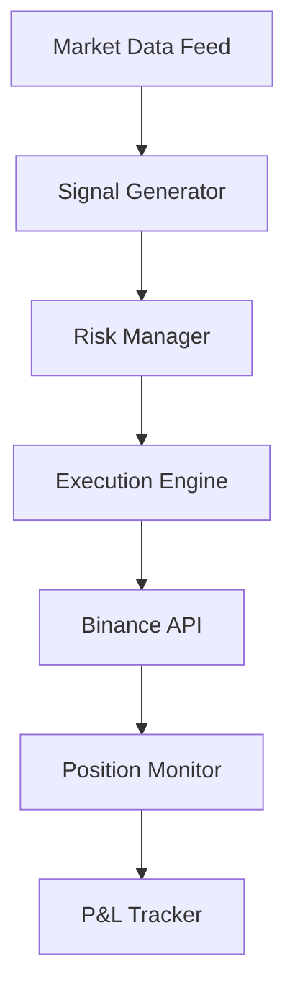

<div align="center">

# 🐋 Balina-Bot

### Production-Grade Binance Futures Algorithmic Trading System

[](https://python.org)
[](https://binance.com)
[](https://docs.python.org/3/library/asyncio.html)
[](LICENSE)

*A high-frequency, event-driven trading engine built from the ground up with Python asyncio.*  
*Designed for sub-millisecond tick processing, real-time risk management, and autonomous operation.*

---

</div>

## 📋 Overview

Balina-Bot is a **fully autonomous** algorithmic trading bot for **Binance USDT-M Perpetual Futures**. It processes real-time market data through async WebSocket pipelines, generates trading signals via proprietary quantitative models, and executes orders with cryptographic authentication — all while maintaining comprehensive risk management guardrails.

Built for **24/7 unattended operation** on Oracle Cloud infrastructure with PM2 process management.

> **Note**: Core strategy logic, mathematical models, and backtesting engines are proprietary and not included in this repository. The infrastructure, architecture, and integration layers are open-source to demonstrate engineering capability.

---

## 🏗️ Architecture



```text
┌─────────────────────────────────────────────────────────────────────┐
│                        BALINA-BOT RUNTIME                          │
├─────────────────────────────────────────────────────────────────────┤
│                                                                     │
│  ┌──────────────┐  ┌──────────────┐  ┌──────────────────────────┐  │
│  │  MAIN PROC   │  │  BRAIN PROC  │  │   TELEGRAM PROC          │  │
│  │              │  │              │  │                          │  │
│  │ • WebSocket  │  │ • Signal     │  │ • Long-Polling           │  │
│  │   Pipeline   │──│   Processing │  │ • Command Interface      │  │
│  │ • LOB Engine │  │ • Feature    │  │ • Daily Reports          │  │
│  │ • Order Exec │  │   Extraction │  │ • ML Training Trigger    │  │
│  │ • FastAPI    │  │              │  │                          │  │
│  └──────┬───────┘  └──────────────┘  └──────────────────────────┘  │
│         │                                                           │
│  ┌──────▼───────────────────────────────────────────────────────┐  │
│  │                    DATA LAKE (Parquet)                        │  │
│  │  • LOB Snapshots  • aggTrade Ticks  • Signal Logs            │  │
│  │  • 6M+ Records    • 470+ Files      • Auto-Compaction        │  │
│  └──────────────────────────────────────────────────────────────┘  │
│                                                                     │
│  ┌──────────────────────────────────────────────────────────────┐  │
│  │                 RISK MANAGEMENT LAYERS                        │  │
│  │  Kelly Criterion │ Circuit Breaker │ VPIN │ MDD Hard-Stop    │  │
│  └──────────────────────────────────────────────────────────────┘  │
└─────────────────────────────────────────────────────────────────────┘
```

---

## ✨ Key Features

<table>
<tr>
<td width="50%">

### 🔌 Real-Time Data Pipeline
- **4 concurrent WebSocket streams** (Depth, Ticker, MarkPrice, Kline)
- Sub-millisecond tick-to-decision latency tracking
- Automatic reconnection with exponential backoff
- Combined stream multiplexing

### 🔐 Security & Authentication
- **Ed25519 digital signatures** for all API requests
- Private key never leaves the server
- Environment-based credential management
- Telegram command authentication (single-user lock)

### 📊 Order Book Engine
- Full Level-2 order book reconstruction
- Real-time bid/ask spread monitoring
- VWAP slippage simulation for market orders
- Depth-weighted mid-price calculation

</td>
<td width="50%">

### 🧠 Risk Management
- **Kelly Criterion** optimal position sizing
- **Global Circuit Breaker** for volume anomalies
- **VPIN** (Volume-synchronized Probability of Informed Trading)
- Daily loss limits with automatic kill switch
- Maximum drawdown hard-stop (15%)
- Post-loss cooldown with exponential backoff

### 📡 Monitoring & Observability
- **FastAPI** real-time health & metrics API
- **Telegram Bot** with 12+ interactive commands
- Automated daily performance reports (UTC 00:00)
- System resource monitoring (CPU, RAM, Disk)
- Live HTML dashboard

### 💾 Data Engineering
- **Parquet-based Data Lake** with auto-compaction
- aggTrade tick collection (10K events/file)
- Signal quality logging for offline analysis
- Walk-forward validation framework

</td>
</tr>
</table>

---

## 🛠️ Tech Stack

| Layer | Technology | Purpose |
|:------|:-----------|:--------|
| **Runtime** | Python 3.10+ | Core language |
| **Concurrency** | `asyncio` + `multiprocessing` | Non-blocking I/O + CPU parallelism |
| **Networking** | `aiohttp` + `websockets` | HTTP client + WebSocket streams |
| **Data** | `pandas` + `pyarrow` | DataFrame ops + Parquet I/O |
| **API** | `FastAPI` + `Uvicorn` | Health endpoints + Dashboard |
| **Security** | `cryptography` (Ed25519) | Request signing |
| **Deployment** | Oracle Cloud + PM2 | Always-free ARM instance |
| **Notifications** | Telegram Bot API | Real-time alerts & commands |

---

## 🚀 Quick Start

```bash
# 1. Clone the repository
git clone https://github.com/Abdulkadir-Turan/balina-bot.git
cd balina-bot

# 2. Create virtual environment
python -m venv venv
source venv/bin/activate  # Linux/Mac
# venv\Scripts\activate   # Windows

# 3. Install dependencies
pip install -r requirements.txt

# 4. Configure environment
cp .env.example .env
# Edit .env with your Binance API key and Telegram token

# 5. Run in DRY_RUN mode (no real trades)
python main.py
```

---

## ⚙️ Configuration

Copy `.env.example` to `.env` and configure:

| Variable | Description |
|:---------|:------------|
| `BINANCE_API_KEY` | Your Binance Futures API key |
| `BINANCE_PRIVATE_KEY_PATH` | Path to Ed25519 PEM private key |
| `TELEGRAM_TOKEN` | Telegram bot token from @BotFather |
| `TELEGRAM_CHAT_ID` | Your Telegram user ID for auth |
| `DRY_RUN` | `True` = simulation mode, `False` = live trading |

---

## 🤖 Telegram Commands

| Command | Description |
|:--------|:------------|
| `/status` | Real-time balance, indicators & position |
| `/pnl` | Today's P&L summary |
| `/pause` | Pause new trade entries |
| `/resume` | Resume trading |
| `/close` | Emergency market close all positions |
| `/symbol` | Show current trading pair |
| `/unlock` | Clear shutdown lock |
| `/ml` | Trigger offline ML model retraining |
| `/help` | List all commands |

---

## 📁 Project Structure

```
balina_bot/
├── analysis/               # Offline data analysis and backtesting scripts
├── api/                    # FastAPI health & dashboard endpoints
│   ├── health.py           # /telemetry, /performance, /update
│   └── dashboard.html      # Live monitoring UI
├── core/                   # Core engine & utilities
│   ├── config.py           # Centralized configuration
│   ├── brain_process.py    # Multiprocessing signal worker
│   ├── audit.py            # Restart & disconnect tracking
│   └── data_lake/          # Parquet storage (gitignored)
├── docs/                   # Documentation
│   ├── ARCHITECTURE.md     # Detailed system design
│   ├── STRATEGY.md         # Strategy overview
│   ├── DEPLOYMENT.md       # Oracle Cloud + PM2 guide
│   └── NEXT_STEPS.md       # Development roadmap
├── execution/              # Trade execution layer
│   ├── engine.py           # Order management & position tracking
│   └── circuit_breaker.py  # Global circuit breaker
├── network/                # Network & communication
│   ├── auth.py             # Ed25519 request signing
│   ├── http_client.py      # Async REST client
│   ├── ws_client.py        # WebSocket stream manager
│   ├── telegram.py         # Notification sender
│   └── telegram_bot.py     # Interactive bot + daily reports
├── orderbook/              # Order book engine
│   └── lob.py              # L2 book reconstruction
├── scripts/                # Utility and helper scripts
├── storage/                # Parquet data lake storage
├── main.py                 # Application entry point
├── requirements.txt        # Python dependencies
└── .env.example            # Environment template
```

---

## 📖 Documentation

- **[Architecture](docs/ARCHITECTURE.md)** — Multi-process design, event loop, WebSocket pipeline
- **[Strategy](docs/STRATEGY.md)** — Trading approach, indicators, and backtest methodology
- **[Deployment](docs/DEPLOYMENT.md)** — Oracle Cloud ARM setup with PM2
- **[Roadmap](docs/NEXT_STEPS.md)** — 30/60/90 day development plan

---

## 🧠 What I Learned

Building this production-grade trading bot provided deep hands-on experience with:
- **Async Programming**: Mastering Python's `asyncio` for non-blocking network I/O, managing concurrent WebSocket streams without thread overhead.
- **API Integration**: Implementing secure, authenticated communication with Binance Futures, including Ed25519 request signing and rate limit handling.
- **Risk Management**: Translating mathematical risk models (Kelly Criterion, maximum drawdown halts) into robust fail-safe code that protects capital.

---

## 📈 Development Journey

This project represents **4+ weeks of intensive development**, evolving through multiple strategy iterations:

1. **Phase 1-15**: Microstructure HFT approach (Z-Score, VPIN, OBI) — abandoned after discovering fee barrier at VIP0 tier
2. **Phase 16-25**: EMA Crossover + RSI trend following — improved but insufficient win rate
3. **Phase 26-29**: Added ADX trend filter, 5m timeframe, volume confirmation
4. **Current**: Data collection phase — gathering aggTrade data for VPIN-enhanced signal validation

> The honest backtest results and iterative development process are documented in [STRATEGY.md](docs/STRATEGY.md).

---

## 🗺️ Roadmap

- **Planned refactor of main.py (769 lines) into modular service components**
- **Machine Learning**: Integration of offline-trained ML models for signal validation.
- **Multi-Pair**: Extending the system to support concurrent multi-pair trading.

---

## ⚠️ Disclaimer

> **This project is for educational and research purposes only.**  
> Trading cryptocurrency futures involves substantial risk of loss. Past performance does not guarantee future results. This software is not financial advice. Use at your own risk.

---

<div align="center">

**Built with ❤️ and lots of ☕ by [Abdulkadir Turan](https://github.com/Abdulkadir-Turan)**

*If you found this useful, consider giving it a ⭐*

</div>
